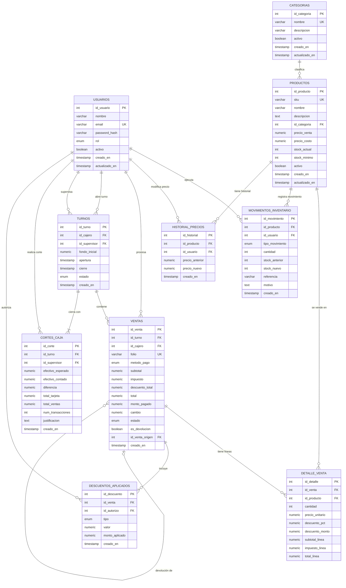

# Modelo de Datos — Sistema POS Ferretería

**Versión:** 1.0  
**Fecha:** 2026-06-29

---

---

## Cardinalidades

| Relación | Tipo | Descripción |
|---|---|---|
| `CATEGORIAS` → `PRODUCTOS` | 1 a muchos | Una categoría agrupa varios productos |
| `PRODUCTOS` → `DETALLE_VENTA` | 1 a muchos | Un producto aparece en múltiples líneas de venta |
| `PRODUCTOS` → `MOVIMIENTOS_INVENTARIO` | 1 a muchos | Cada producto acumula sus entradas/salidas |
| `PRODUCTOS` → `HISTORIAL_PRECIOS` | 1 a muchos | Cada cambio de precio queda registrado |
| `USUARIOS` → `TURNOS` | 1 a muchos | Un cajero puede tener varios turnos |
| `TURNOS` → `VENTAS` | 1 a muchos | Un turno contiene todas las ventas del período |
| `TURNOS` → `CORTES_CAJA` | 1 a exactamente 1 | Cada turno tiene un único corte de caja |
| `VENTAS` → `DETALLE_VENTA` | 1 a muchos | Una venta tiene una o más líneas de producto |
| `VENTAS` → `VENTAS` | 0..1 a muchos | Una venta puede originar devoluciones |

---

## Notas técnicas

- **Baja lógica:** `PRODUCTOS` y `USUARIOS` usan el campo `activo` — nunca se eliminan físicamente.
- **Auditoría inmutable:** `HISTORIAL_PRECIOS` y `MOVIMIENTOS_INVENTARIO` no tienen `UPDATE` ni `DELETE` permitidos por política de aplicación.
- **Devoluciones:** `VENTAS.id_venta_origen` es auto-referencia; `es_devolucion = TRUE` identifica notas de crédito.
- **Corte único:** `CORTES_CAJA.id_turno` tiene restricción `UNIQUE` — un turno sólo puede cerrarse una vez.
- **Precisión monetaria:** Todos los importes usan `NUMERIC(12,2)` para evitar errores de punto flotante.
